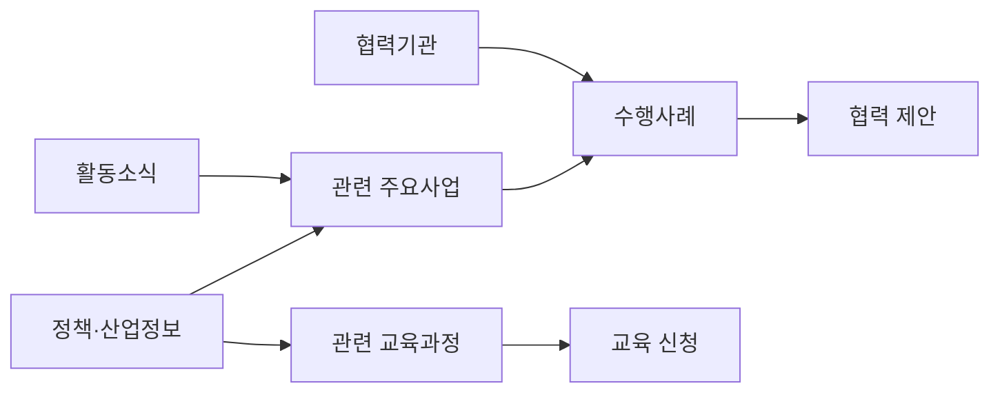

# 사이트맵

## 1. 설계 원칙

① 상위 메뉴는 6개 이내로 유지한다.  
② 협회형 `회원사` 메뉴는 진흥원에 맞게 `참여·협력`으로 변경한다.  
③ 정책, 공고, 자료를 무조건 분리하지 않고 사용 목적에 따라 묶는다.  
④ 교육·행사는 신청 전환이 중요한 독립 메뉴로 둔다.  
⑤ 관리자 기능은 일반 사이트맵과 분리한다.

## 2. 전체 사이트맵

```text
홈

진흥원 소개
├── 기관개요
├── 인사말
├── 비전·핵심가치
├── 연혁
├── 조직도
└── 오시는길

주요사업
├── AI·디지털 전환 교육
├── 스마트산업 연구·정책
├── 기업·창업 지원
├── 지역혁신·스마트빌리지
├── 산학연 협력
├── 전문가 네트워크
└── 수행사례

교육·행사
├── 교육과정
│   ├── 과정 목록
│   └── 과정 상세
├── 세미나·포럼
├── 행사 일정
└── 참가 신청

정보·자료
├── 정책·산업정보
├── 정부지원사업
├── 연구보고서
├── 교육자료
├── 발간물·서식
└── 통합 검색

소식
├── 공지사항
├── 진흥원 활동
├── 보도자료
└── 갤러리

참여·협력
├── 협력기관
├── 사업 협력 제안
├── 기업 지원 문의
├── 전문가·강사 등록
└── 일반 문의

기타
├── 개인정보 처리방침
├── 이용약관
├── 이메일 무단수집 거부
└── 사이트맵
```

## 3. 1차 MVP 사이트맵

초기에는 콘텐츠 부족과 운영 부담을 줄이기 위해 다음 화면만 우선 구현한다.

```text
홈
├── 진흥원 소개
│   ├── 기관개요
│   ├── 인사말
│   ├── 비전·핵심가치
│   ├── 조직도
│   └── 오시는길
├── 주요사업
│   ├── 사업 목록
│   ├── 사업 상세
│   └── 수행사례
├── 교육·행사
│   ├── 목록
│   ├── 상세
│   └── 신청
├── 정보·자료
│   ├── 정책·산업정보
│   ├── 정부지원사업
│   └── 자료실
├── 소식
│   ├── 공지사항
│   └── 활동소식
└── 참여·협력
    ├── 협력기관
    └── 문의·제안
```

## 4. URL 구조안

| 화면 | URL |
|---|---|
| 홈 | `/` |
| 기관개요 | `/about/overview` |
| 인사말 | `/about/greeting` |
| 비전·핵심가치 | `/about/vision` |
| 연혁 | `/about/history` |
| 조직도 | `/about/organization` |
| 오시는길 | `/about/location` |
| 사업 목록 | `/business` |
| 사업 상세 | `/business/:slug` |
| 수행사례 목록 | `/cases` |
| 수행사례 상세 | `/cases/:slug` |
| 교육·행사 목록 | `/programs` |
| 교육·행사 상세 | `/programs/:id` |
| 교육 신청 | `/programs/:id/apply` |
| 정책·산업정보 | `/insights` |
| 정부지원사업 | `/opportunities` |
| 자료실 | `/resources` |
| 공지사항 | `/notices` |
| 활동소식 | `/news` |
| 협력기관 | `/partners` |
| 문의·제안 | `/contact` |
| 전문가 등록 | `/experts/apply` |
| 통합 검색 | `/search?q=` |
| 관리자 로그인 | `/admin/login` |
| 관리자 대시보드 | `/admin` |

## 5. 메인 메뉴와 보조 메뉴

### 5.1 헤더 메뉴

- 진흥원 소개
- 주요사업
- 교육·행사
- 정보·자료
- 소식
- 참여·협력

### 5.2 헤더 우측 기능

- 통합 검색
- 교육·행사 신청
- 전체 메뉴

초기에는 일반 회원가입과 로그인 버튼을 노출하지 않는다. 관리자 로그인은 별도 URL로 접근한다.

### 5.3 푸터 메뉴

- 개인정보 처리방침
- 이용약관
- 이메일 무단수집 거부
- 사이트맵
- 대표 주소·전화·이메일
- 사업자 또는 법인 기본정보
- SNS 링크

## 6. 콘텐츠 유형별 연결 구조



## 7. 관리자 사이트맵

```text
관리자
├── 대시보드
├── 콘텐츠 관리
│   ├── 공지사항
│   ├── 활동소식
│   ├── 교육·행사
│   ├── 주요사업
│   ├── 수행사례
│   ├── 정책·산업정보
│   └── 자료실
├── 신청·문의 관리
│   ├── 교육 신청
│   ├── 협력 제안
│   ├── 기업 지원 문의
│   └── 전문가 등록
├── 사이트 관리
│   ├── 메인 배너
│   ├── 팝업
│   ├── 협력기관
│   ├── 메뉴
│   └── 기관 기본정보
├── 사용자·권한
└── 로그·통계
```

## 8. 확정이 필요한 메뉴

- `전문가·강사 등록`을 1차에 포함할지 여부
- `정부지원사업`과 `정책·산업정보`를 분리할 만큼 콘텐츠를 운영할 수 있는지 여부
- `보도자료`를 독립 게시판으로 둘지 활동소식의 분류로 둘지 여부
- `연혁`과 `수행사례`에 들어갈 초기 콘텐츠 확보 여부
- 일반 회원 또는 회원사 제도를 실제로 운영할지 여부
