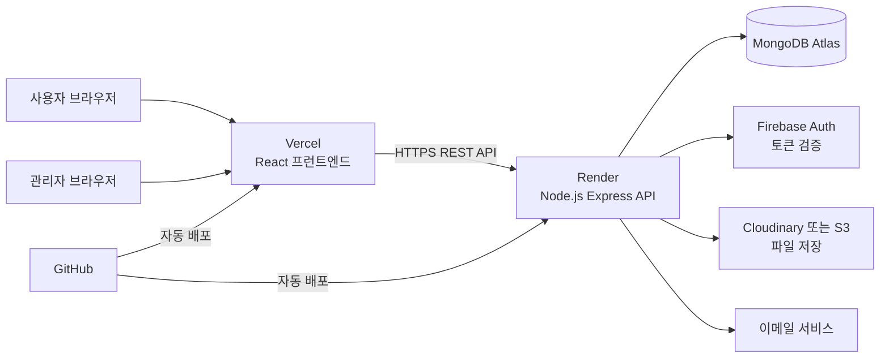
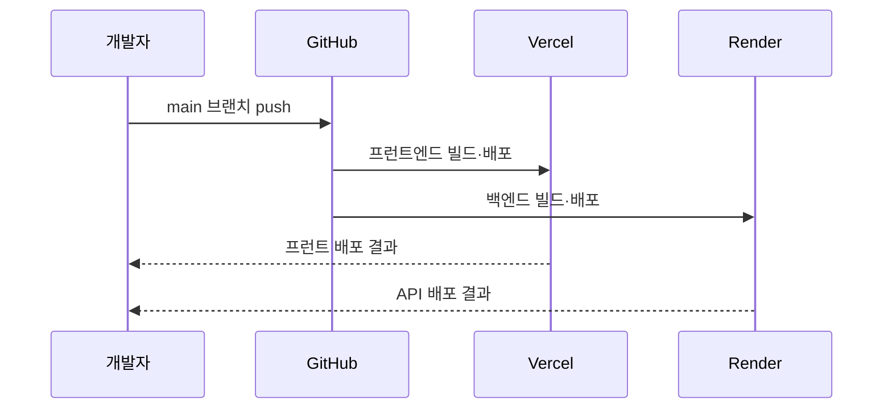

# 기술 아키텍처

## 1. 아키텍처 목표

- Vercel과 Render를 활용한 저비용 초기 운영
- 프런트엔드와 백엔드 분리
- 관리자 콘텐츠 운영 지원
- 향후 AI 기능과 외부 API 연계 가능
- GitHub 기반 배포와 변경 이력 관리

## 2. 권장 기술 스택

| 계층 | 기술 | 선정 이유 |
|---|---|---|
| 프런트엔드 | React + Vite + TypeScript | 빠른 개발, 컴포넌트 재사용, Vercel 배포 용이 |
| UI | Tailwind CSS | 디자인 토큰과 반응형 화면 구현 용이 |
| 라우팅 | React Router | 공개·관리자 경로 분리 |
| 서버 상태 | TanStack Query | API 캐시, 로딩, 오류 상태 관리 |
| 백엔드 | Node.js + Express + TypeScript | 원장님의 기술 경험과 교육·유지보수 적합성 |
| 데이터베이스 | MongoDB Atlas | 콘텐츠형 데이터와 빠른 MVP 구현에 적합 |
| ODM | Mongoose | 스키마, 검증, 인덱스 관리 |
| 인증 | Firebase Authentication | 관리자 이메일 로그인과 토큰 검증 |
| 파일 저장 | Cloudinary 또는 AWS S3 | 이미지·문서를 Render 로컬 디스크와 분리 |
| 이메일 | Resend 또는 SMTP | 신청·문의 접수 알림 |
| 프런트 배포 | Vercel | 정적 자산 CDN과 자동 배포 |
| 백엔드 배포 | Render | Node.js API 운영과 GitHub 연동 |
| 소스 관리 | GitHub | 브랜치, 이슈, 코드리뷰, 배포 이력 |

## 3. 전체 구성도



## 4. 저장소 구조안

단일 저장소를 사용하는 모노레포 방식이 초기 관리에 편리하다.

```text
fsipi-website/
├── apps/
│   ├── web/                 # React + Vite
│   │   ├── src/
│   │   │   ├── components/
│   │   │   ├── pages/
│   │   │   ├── layouts/
│   │   │   ├── features/
│   │   │   ├── api/
│   │   │   └── styles/
│   │   └── public/
│   └── api/                 # Node.js + Express
│       ├── src/
│       │   ├── routes/
│       │   ├── controllers/
│       │   ├── services/
│       │   ├── models/
│       │   ├── middleware/
│       │   ├── validators/
│       │   └── config/
│       └── tests/
├── packages/
│   └── shared/              # 공통 타입과 상수
├── planning/
├── docs/
├── .github/workflows/
└── README.md
```

초기 복잡도를 줄이려면 `client/`, `server/` 2개 폴더로 시작해도 된다.

## 5. 핵심 데이터 모델

### 5.1 Content

```text
Content
- type: notice | news | insight | opportunity | resource
- title
- slug
- summary
- body
- category
- tags[]
- thumbnail
- attachments[]
- sourceName
- sourceUrl
- status: draft | scheduled | published | private
- publishedAt
- createdBy
- createdAt
- updatedAt
```

### 5.2 Program

```text
Program
- title
- type: education | seminar | forum | event
- summary
- description
- target
- curriculum[]
- instructors[]
- startAt
- endAt
- applyStartAt
- applyEndAt
- location
- deliveryMode
- fee
- capacity
- status
- attachments[]
```

### 5.3 Application

```text
Application
- programId
- name
- email
- phone
- organization
- role
- motivation
- consentVersion
- consentAt
- status: received | reviewing | approved | waiting | cancelled
- adminMemo
- createdAt
```

### 5.4 Inquiry

```text
Inquiry
- inquiryType
- organization
- name
- email
- phone
- title
- message
- attachments[]
- consentVersion
- status
- assignedTo
- history[]
- createdAt
```

### 5.5 Business·Case·Partner

- Business: 사업 소개
- CaseStudy: 수행사례
- Partner: 협력기관
- SiteSetting: 기관정보, 메인 배너, 연락처, SNS
- AdminUser: 관리자 UID, 역할, 활성 상태
- AuditLog: 관리자 행위 기록

## 6. API 구조안

```text
GET    /api/health
GET    /api/contents
GET    /api/contents/:slug
GET    /api/programs
GET    /api/programs/:id
POST   /api/programs/:id/applications
GET    /api/businesses
GET    /api/cases
GET    /api/partners
POST   /api/inquiries
GET    /api/search

POST   /api/admin/contents
PATCH  /api/admin/contents/:id
DELETE /api/admin/contents/:id
GET    /api/admin/applications
PATCH  /api/admin/applications/:id/status
GET    /api/admin/inquiries
PATCH  /api/admin/inquiries/:id
GET    /api/admin/settings
PATCH  /api/admin/settings
```

관리자 API는 Firebase ID Token과 역할 검증을 통과한 요청만 허용한다.

## 7. 환경변수

### 7.1 Vercel

```text
VITE_API_BASE_URL=
VITE_FIREBASE_API_KEY=
VITE_FIREBASE_AUTH_DOMAIN=
VITE_FIREBASE_PROJECT_ID=
```

### 7.2 Render

```text
NODE_ENV=production
PORT=10000
CLIENT_ORIGIN=
MONGODB_URI=
FIREBASE_PROJECT_ID=
FIREBASE_CLIENT_EMAIL=
FIREBASE_PRIVATE_KEY=
CLOUDINARY_CLOUD_NAME=
CLOUDINARY_API_KEY=
CLOUDINARY_API_SECRET=
EMAIL_API_KEY=
EMAIL_FROM=
ADMIN_NOTIFICATION_EMAIL=
```

비밀값은 GitHub 저장소와 프런트엔드 코드에 포함하지 않는다.

## 8. CORS 정책

- 운영: FSIPI Vercel 도메인과 공식 도메인만 허용
- 개발: `localhost`와 필요한 Codespaces 도메인만 허용
- 메서드: GET, POST, PATCH, DELETE, OPTIONS
- 인증이 필요한 경우 Authorization 헤더 허용
- `*` 와일드카드는 운영에서 사용하지 않음

## 9. 배포 흐름



### 9.1 프런트엔드

- Build Command: `npm run build`
- Output Directory: `dist`
- SPA 라우팅을 위한 Vercel rewrite 설정

### 9.2 백엔드

- Build Command: `npm ci && npm run build`
- Start Command: `npm start`
- Health Check: `/api/health`

## 10. 개발 환경

- Windows 11 또는 Codespaces
- Node.js LTS
- npm 또는 pnpm 중 하나로 통일
- ESLint, Prettier
- 환경별 `.env.example`
- Postman 또는 Bruno API 테스트
- MongoDB Atlas 개발·운영 DB 분리

## 11. 테스트 전략

| 테스트 | 도구 예시 | 범위 |
|---|---|---|
| 단위 테스트 | Vitest | 유틸, 검증, 서비스 |
| API 테스트 | Supertest | 인증, CRUD, 신청, 문의 |
| UI 테스트 | React Testing Library | 폼과 주요 컴포넌트 |
| E2E | Playwright | 검색, 신청, 관리자 등록 |
| 접근성 | Lighthouse, axe | 주요 화면 |
| 보안 점검 | npm audit, 입력 검증 테스트 | 의존성과 API |

## 12. SEO 고려사항

React SPA만 사용하면 검색엔진이 일부 콘텐츠를 늦게 수집할 수 있다. 초기에는 다음을 적용한다.

- 페이지별 title과 description
- Open Graph
- sitemap.xml 생성
- robots.txt
- 중요 정적 페이지의 사전 렌더링 검토
- 구조화 데이터

기관 콘텐츠의 검색 노출이 매우 중요해지면 Next.js로 전환하거나 정적 사전 렌더링 도구를 추가한다. MVP 단계에서는 React+Vite로 시작하되 URL과 데이터 API를 프레임워크에 종속되지 않게 설계한다.

## 13. 확장 아키텍처

### 13.1 AI 검색

- 콘텐츠 정제
- 임베딩 생성
- 벡터 데이터베이스
- RAG API
- 출처 링크와 인용 표시
- 관리자 검토

### 13.2 외부 공고 연계

- 공식 API 또는 RSS 우선
- 수집 주기와 실패 로그
- 중복 제거
- 출처·원문 링크 저장
- 자동 공개 금지

### 13.3 트래픽 증가 시

- Render 인스턴스 상향
- Redis 캐시
- 이미지 CDN
- 검색엔진 분리
- 백그라운드 작업 큐

## 14. 기술 의사결정 요약

| 항목 | 결정 |
|---|---|
| 초기 프런트엔드 | React + Vite + TypeScript |
| 초기 백엔드 | Node.js + Express + TypeScript |
| 데이터베이스 | MongoDB Atlas |
| 관리자 인증 | Firebase Authentication |
| 파일 | Cloudinary 또는 S3 |
| 배포 | Vercel + Render |
| 운영 방식 | 관리자 승인형 콘텐츠 관리 |
| AI 기능 | 2차 이후 별도 모듈 |
